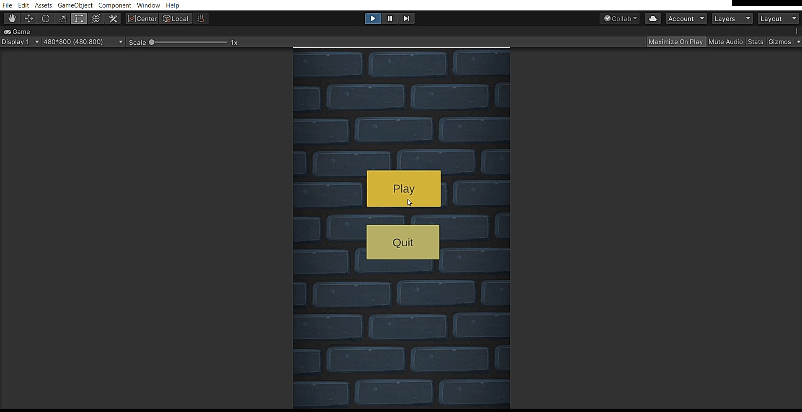
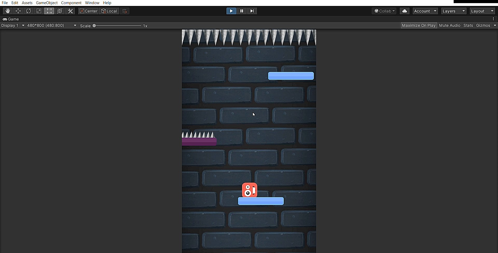
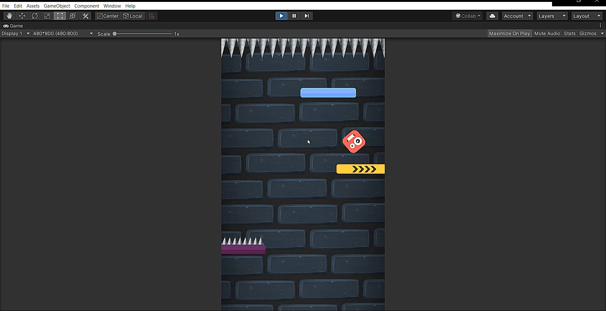
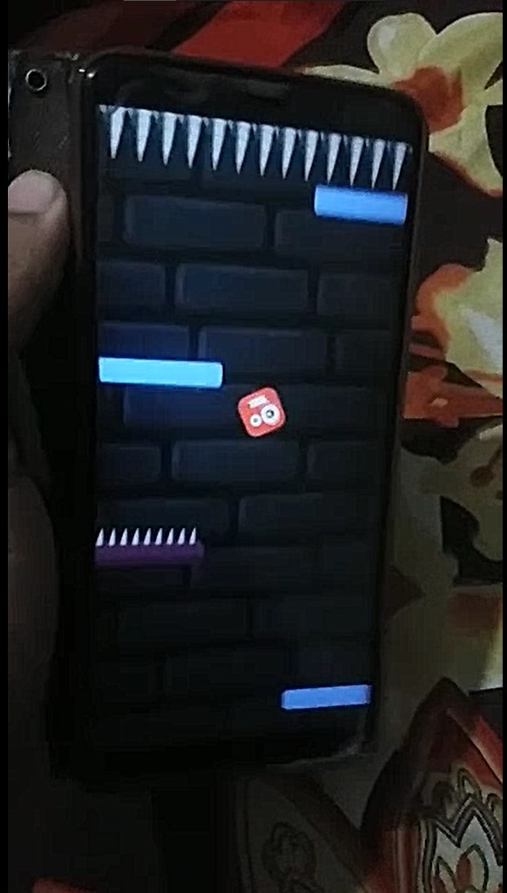
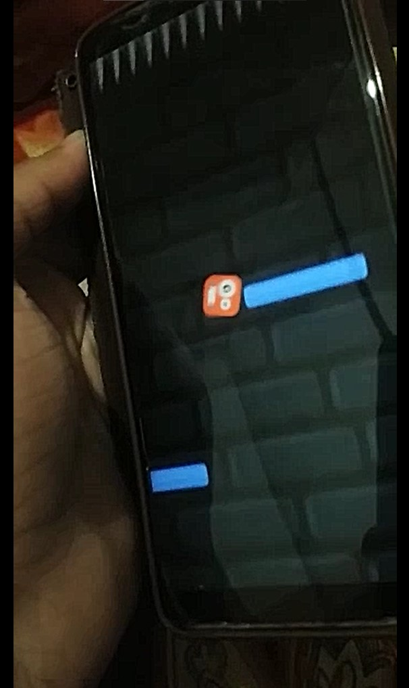

# 2D HyperCasualGame In Unity 3D:

This is a 2D HyperCasual Game in which a cube is there which is in the game screen and the whole platform is moving
upwards so we have to drop the cube to various platform like one which is pure solid,one break in some seconds,
one accelerate the cube into one direction,and a spike one we have to manage the cube such that the cube 
remain in the screen and dont fall down
as well as dont touch the spikes at the top most of it in this game i also enable the gyroscope sensor function
for phones for easy playing

Screenshots
-----------

